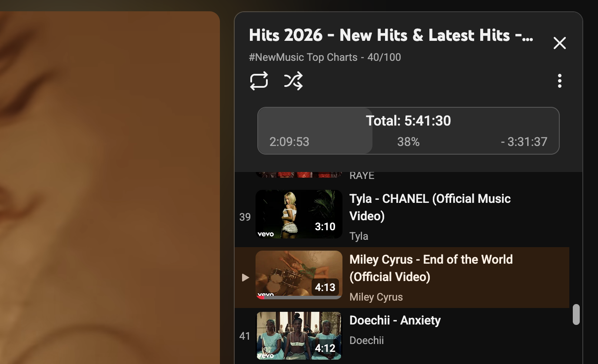
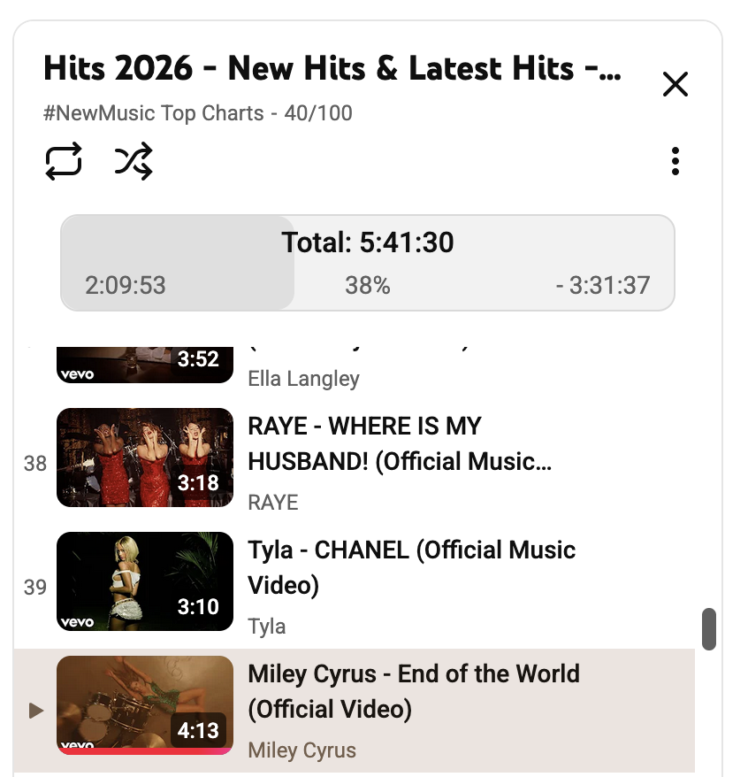

# YouTube Playlist Duration Bar

**Know exactly how long your YouTube playlists are — and how far you've come.**

---

## What it does

YouTube doesn't show you how long a playlist is, or how much of it you've already watched. This extension fixes that.

Install it once, and every playlist you open instantly shows:

- **Total playlist duration** — no more guessing if this study session or movie marathon fits your schedule
- **A live progress bar** — see at a glance how far through the playlist you are
- **Watched time & percentage** — track your viewing progress as you go
- **Remaining time** — know exactly how much is left

Everything updates automatically as you watch, skip, or reorder videos — no page reloads needed.

---

## Screenshots

| While watching | Browsing a playlist |
|---|---|
|  |  |
|  |  |

---

## Features

### While watching a playlist video
- **Total duration** of the entire playlist
- **Watched time** — how much you've already seen
- **Progress percentage** — shown both as a number and a visual bar
- **Remaining time** — how long until the playlist ends

### While browsing a playlist page
- **Total duration** of all loaded videos
- **Video count** — number of videos currently loaded

### Works everywhere
- Public playlists, private playlists, Watch Later, Liked Videos
- Dark mode and light mode — matches YouTube's current theme automatically
- Adapts when videos are added, removed, or reordered in real time
- Available for **Chrome** and **Firefox**

> **Note:** YouTube's UI loads approximately 200 videos at a time. Scroll down to load more videos for an accurate count on very large playlists.

---

## Installation

| Browser | Link |
|---------|------|
| Chrome | [Chrome Web Store →](https://chrome.google.com/webstore/detail/youtube-playlist-duration/klbacnllhiilbiiedcbgfafmnedldgeg?hl=en-GB) |
| Firefox | [Firefox Add-ons →](https://addons.mozilla.org/en-US/firefox/addon/youtube-playlist-duration-bar/) |

---

## Why use this extension?

Whether you're:

- **Studying** with YouTube lecture playlists and need to plan your session
- **Working out** to a music playlist and want to track your progress
- **Binging** a podcast, documentary series, or tutorial course
- **Managing a playlist** and want to know its total runtime at a glance

…this extension gives you the information YouTube should have shown you in the first place.

---

## Contributing

The project is open source and actively maintained. Contributions, bug reports, and feature requests are welcome.

- [Open an issue](../../issues)
- [Read the changelog](CHANGELOG.md)

---

## Privacy

This extension does not collect, transmit, or store any personal data. It runs entirely in your browser and only reads the video duration elements already visible on your screen.
